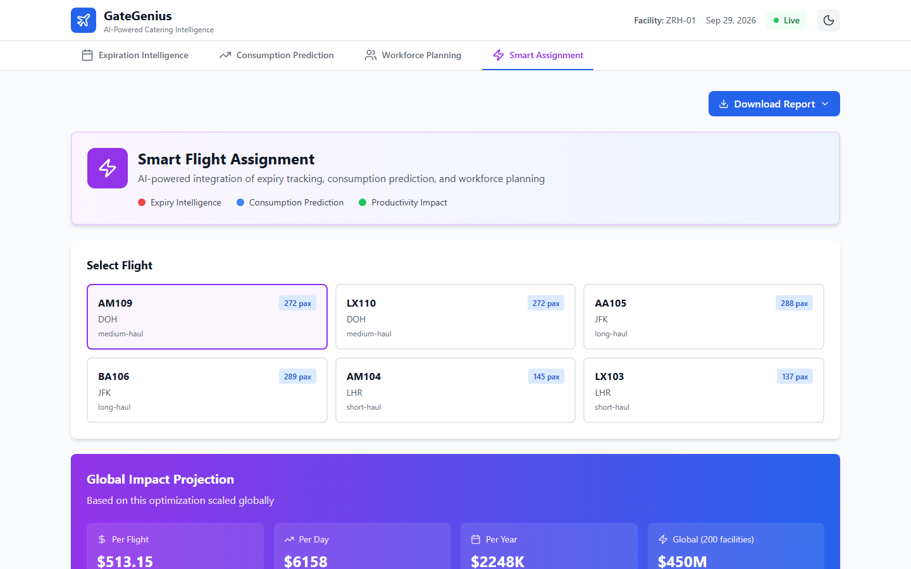

# GateGenius

Panel de operaciones de catering aéreo que hicimos en el HackMTY 2025 para el reto de Gategroup. Ayuda a que los productos próximos a caducar se asignen a los vuelos que más probablemente los consuman.

**Sitio en vivo:** https://gategenius.vercel.app (corre completo en el navegador con los datos del reto, sin login)


Equipo: Abel, Hermann, Diego y Oscar. Mi parte fue el módulo de caducidades. Repositorio original del equipo: [oscarcv125/gategenius](https://github.com/oscarcv125/gategenius).

## Módulos

- **Caducidades:** registra cada lote y su fecha, avisa de lo que caduca hoy o en 7 días, calcula el valor en riesgo y permite escanear productos con la cámara usando la API de visión de Gemini.
- **Predicción de consumo:** historial de consumo por vuelo, costo de desperdicio y productos con riesgo de faltante.
- **Planeación de personal:** horas de trabajo estimadas según la complejidad de los cajones y gráficas de horas pico.
- **Asignación inteligente:** califica los productos próximos a caducar contra los vuelos y propone asignaciones para aprobar.

Cada vista exporta reportes en PDF, Excel o CSV y la interfaz tiene modo claro y oscuro.

| Predicción de consumo | Asignación inteligente |
|---|---|
|  |  |

Los montos en dólares de la asignación inteligente son estimaciones del hackathon calculadas con los datos del reto, no resultados medidos. Las fechas de caducidad de los datos de ejemplo son de 2025, así que hoy el sitio en vivo muestra todos los lotes como vencidos. Las capturas son de cuando los datos aún estaban vigentes.

## Tecnologías

- React 19, Vite 7 y Tailwind CSS
- Zustand para el estado y Recharts para las gráficas
- PapaParse para leer los CSV, jsPDF y SheetJS para los reportes
- API de Gemini para el escáner de productos
- Servidor opcional con Express, MySQL y JWT (el sitio en vivo no lo necesita)

## Cómo correrlo en local

Necesitas Node.js 18 o superior.

```bash
npm install
cp .env.example .env
npm run dev
```

Se abre en http://localhost:5173. La variable `VITE_GEMINI_API_KEY` es opcional y solo activa el escáner con cámara. Otros comandos: `npm run build`, `npm run lint` y `npm run dev:full` (servidor opcional y frontend juntos).

## Estructura

```
src/features/      caducidades, consumo, productividad y asignación inteligente
src/modules/       un panel por módulo
src/algorithms/    smartAssignment.js, la calificación de productos por vuelo
src/api/           clientes de Gemini y escáner de productos
src/utils/         generadores de reportes y utilidades
public/data/       archivos CSV del reto
server/            API opcional con Express y MySQL
```

Autor: [Hermann Pauwells Rivera](https://hermannpr.github.io/)

## Licencia

[MIT](LICENSE). Datos del reto cortesía de Gategroup para el HackMTY 2025.
