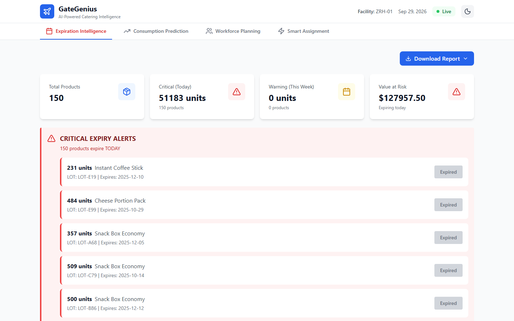
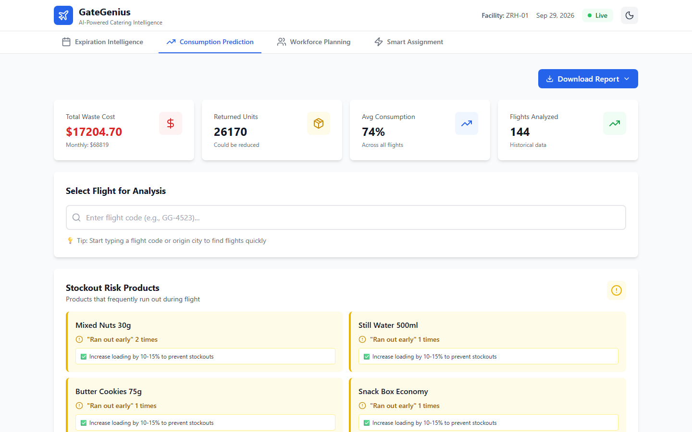
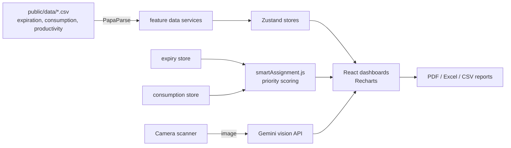

# GateGenius

> **EN:** Airline catering operations dashboard built at HackMTY 2025 for the Gategroup challenge: expiry tracking, consumption prediction, workforce planning and a smart assignment that sends near-expiry products to the flights most likely to use them.
> **ES:** Dashboard de operaciones de catering aéreo hecho en HackMTY 2025 para el reto de Gategroup: caducidades, predicción de consumo, planeación de personal y asignación inteligente de productos a vuelos.

[](https://hackmty.com)
[](https://react.dev)
[](https://vitejs.dev)
[](https://tailwindcss.com)

**Live demo:** [gategenius.vercel.app](https://gategenius.vercel.app) (runs entirely in the browser on the challenge CSV data, no login)
**Team:** Abel, Hermann, Diego, Oscar · **My part:** [Hermann Pauwells Rivera](https://hermannpr.github.io/) built the Expiration Intelligence module.



## The challenge

Gategroup brought three operational problems to HackMTY 2025: products expiring before they are loaded, flights provisioned with too much or too little, and drawer-assembly staffing planned by hand. GateGenius answers each with a module and then combines them.

## Modules

| Module | What it does |
|---|---|
| **Expiration Intelligence** (my module) | Tracks every LOT and expiry date, raises critical (today) and warning (7 days) alerts, computes value at risk, and supports product scanning with the camera through the Gemini vision API. |
| **Consumption Prediction** | Per-flight consumption history, waste cost, returned units, and stockout-risk products with loading recommendations. |
| **Workforce Planning** | Worker-hour estimates from drawer complexity, peak-time charts and utilization. |
| **Smart Assignment** | Scores near-expiry products against upcoming flights (days to expiry, historical consumption rate, route and flight type, product value) and proposes assignments for approval. |

Every view can export a report as PDF, Excel or CSV, and the UI supports light and dark mode.

| Consumption Prediction | Smart Assignment |
|---|---|
|  |  |

The dollar projections shown in the Smart Assignment view are hackathon estimates computed from the challenge dataset, not measured results. The sample expiry data is from 2025, so the live demo now shows every lot as expired.

## Architecture



Code is organized by feature (`src/features/<module>/{services,store,utils}`), with business logic separated from data loading so each team member could own one module during the event. `server/index.js` is an optional Express + MySQL API with JWT auth that the deployed demo does not need.

## Tech stack

- React 19, Vite 7, Tailwind CSS 3.4, Zustand, Recharts
- PapaParse for CSV ingestion, jsPDF + jspdf-autotable and SheetJS (xlsx) for reports
- Gemini API (vision) for product scanning
- Optional backend: Express, MySQL, bcrypt, JWT

## Run locally

Requires Node.js 18+.

```bash
npm install
cp .env.example .env    # optional: VITE_GEMINI_API_KEY enables camera scanning
npm run dev             # http://localhost:5173
```

Other scripts: `npm run build`, `npm run preview`, `npm run lint`, `npm run server` (optional API), `npm run dev:full` (API + frontend).

Note: any `VITE_` variable is bundled into the browser build, so use a restricted, low-quota Gemini key if you enable scanning on a public deployment.

## Project structure

```
src/
  features/        expiration, consumption, productivity, smartAssignment (services, stores, utils)
  modules/         one dashboard component per module
  algorithms/      smartAssignment.js (product-to-flight scoring)
  api/             Gemini and Cloud Vision clients, product scanner
  components/      layout and shared widgets (charts, tables, camera scanner, report downloader)
  utils/           date helpers, product matcher, PDF/Excel/CSV report generators
public/data/       challenge CSV datasets
server/            optional Express + MySQL API
```

## Status

Hackathon project (HackMTY 2025), feature-complete for the demo and no longer under active development. Original team repository: [oscarcv125/gategenius](https://github.com/oscarcv125/gategenius).

## License

[MIT](LICENSE). Challenge data courtesy of Gategroup for HackMTY 2025.
